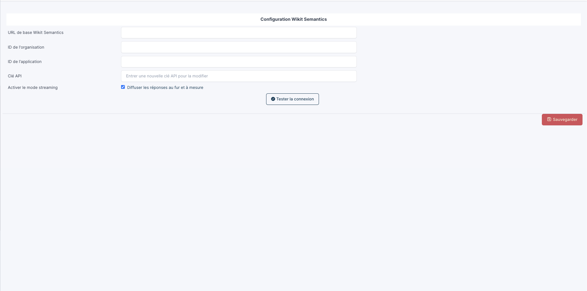
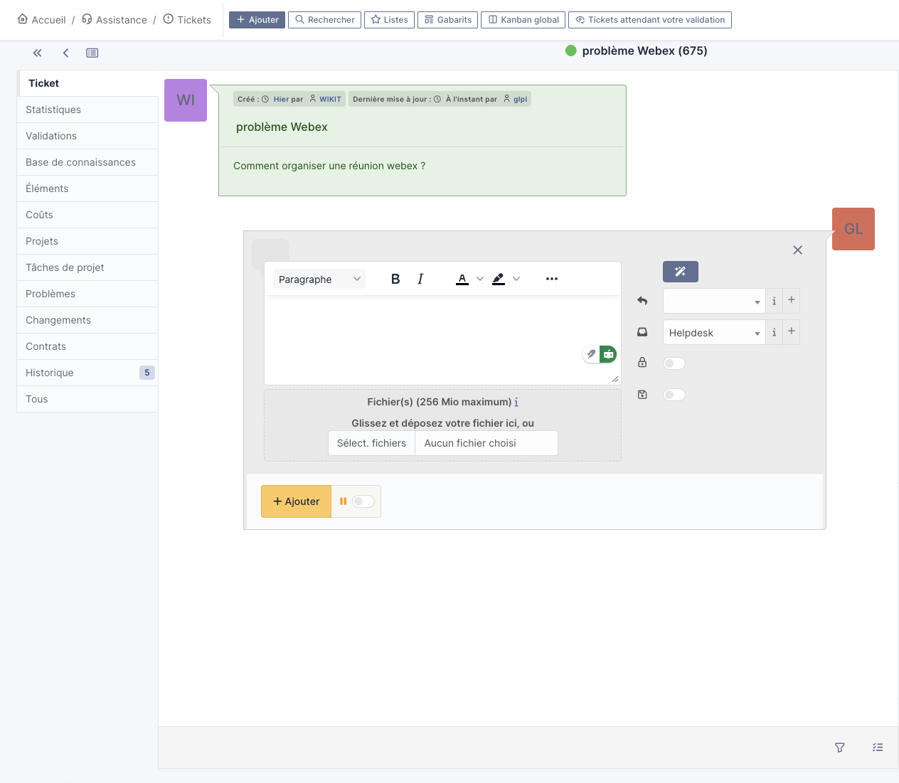
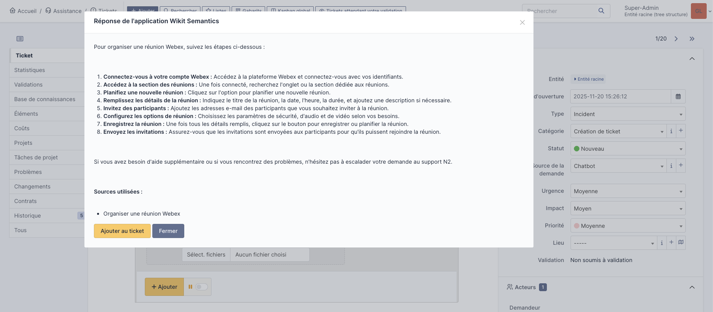

# Wikit Semantics Plugin for GLPI

## Overview

The **Wikit Semantics** plugin brings AI-powered semantic search and intelligent question-answering capabilities to your GLPI installation. By connecting your GLPI instance to the Wikit Semantics API, you can leverage advanced natural language processing to help users get answers quickly for tickets.

## What Does It Do?

This plugin enables users to find in natural language a answer to tickets, context-aware answers based on your organization's knowledge base. Instead of manually searching through tickets, documentation, or FAQ entries, users can simply find solutions and get immediate, relevant responses.

### Key Benefits

- **Faster Support Resolution**: Get instant answers to common questions without waiting for human intervention
- **Knowledge Base Enhancement**: Leverage AI to make your existing GLPI data more accessible and useful
- **Seamless Integration**: Works directly within your GLPI interface - no need to switch between applications

## Features

- Direct integration with Wikit Semantics API
- Secure API authentication with organization and application-level controls
- Easy configuration through GLPI's admin interface
- Connection testing to verify API setup
- Support for GLPI 10.0+ and 11.0+
- Real-time streaming responses (GLPI 11+)
- Multiple integration points: Followups, Solutions, and Tasks

## Screenshots

### Configuration Interface

### Integration with GLPI Forms

## Requirements

### Version Compatibility

| Plugin Version | GLPI Version | PHP Version | Branch | Status |
|---------------|--------------|-------------|--------|--------|
| 1.x.x | 10.0.0 - 10.9.99 | 8.0+ | `1.x` | Maintenance only |
| 2.x.x | 11.0.0+ | 8.2+ | `2.x` | Active development |

**Important**:
- For **GLPI 10.x**, use version 1.x of this plugin
- For **GLPI 11.x**, use version 2.x of this plugin
- Versions are not cross-compatible

### Prerequisites

- Active Wikit Semantics account with:
  - API URL
  - Organization ID
  - Application ID
  - API Key

## Quick Setup
0. Download repository and rename folder wikitsemantics
1. Install the plugin in your GLPI plugins directory move folder wikitsemantics to plugins directory, should be something like that : /var/www/html/glpi/marketplace/
2. Activate the plugin from the GLPI interface
3. Navigate to the plugin configuration page
4. Enter your Wikit Semantics API credentials
5. Test the connection to verify everything is working
6. Start using AI-powered semantic search in your GLPI instance

## About Wikit Semantics

Wikit Semantics provides enterprise-grade AI solutions for intelligent information retrieval and knowledge management. Visit [Wikit](https://wikit.ai) for more information.

## Contributing

* Open a ticket for each bug/feature so it can be discussed
* Work on a new branch on your own fork
* Open a PR that will be reviewed by a developer

## License

This plugin is licensed under the Apache 2.0 License.

## Support

For issues, questions, or contributions, please visit our [GitHub repository](https://github.com/wikit-ai/GLPI-Semantics).

---

**Copyright**: © 2026 Wikit
